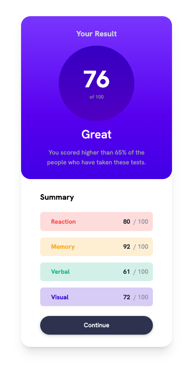
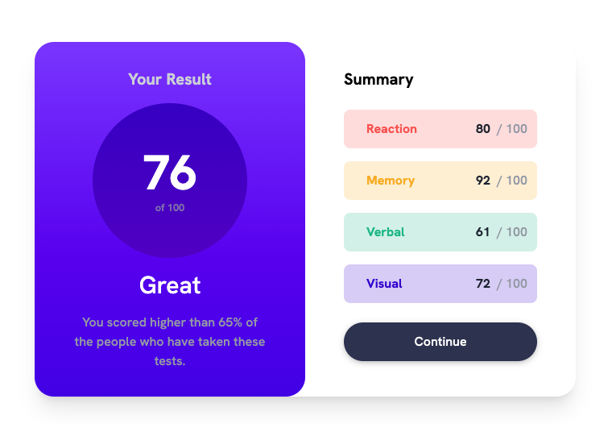

# Frontend Mentor - Results summary component solution

This is a solution to the [Results summary component challenge on Frontend Mentor](https://www.frontendmentor.io/challenges/results-summary-component-CE_K6s0maV). Frontend Mentor challenges help you improve your coding skills by building realistic projects.

## Table of contents

- [Overview](#overview)
  - [The challenge](#the-challenge)
  - [Screenshot](#screenshot)
  - [Links](#links)
  - [Built with](#built-with)
- [Useful resources](#useful-resources)
- [Author](#author)

## Overview

Hello! This is my solution to the "Result Summary Component" challenge by Frontend Mentor. I'm grateful to have discovered Frontend Mentor and to participate in this challenge.

### The challenge

Users should be able to:

- View the optimal layout for the interface depending on their device's screen size
- See hover and focus states for all interactive elements on the page

### Screenshot

### Links

- Solution URL: [solution URL](https://github.com/itsdaiyy/results-summary-component/)
- Live Site URL: [live site URL](https://itsdaiyy.github.io/results-summary-component/)

### Built with

- Semantic HTML5 markup
- CSS custom properties
- Mobile-first workflow
- [Tailwindcss](https://tailwindcss.com/)

## Useful resources

- [Button Hover Effects #2](https://codepen.io/aaroniker/pen/abzbRvo) - This helped me to build jumping text button hover effects.

## Author

- Frontend Mentor - [@itsdaiyy](https://www.frontendmentor.io/profile/itsdaiyy)
